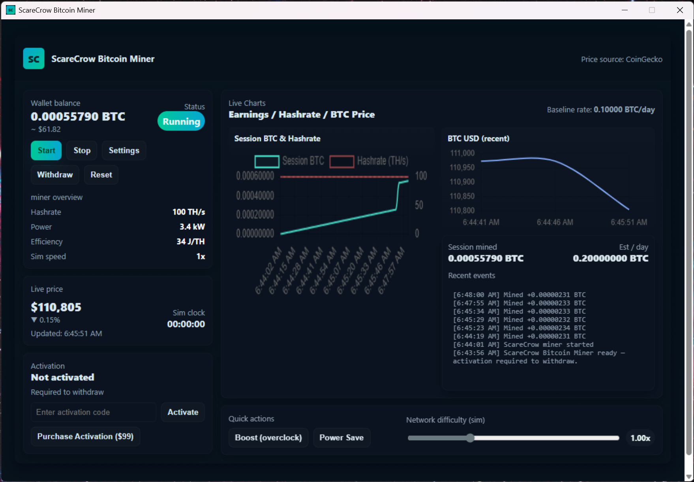

# ScareCrow-Bitcoin-Miner
ScareCrow Bitcoin Miner is a powerful, user-friendly mining application that delivers real-time BTC earnings, live market prices, and professional-grade performance monitoring in one compact dashboard.

ScareCrow Bitcoin Miner is the next generation of cryptocurrency mining software designed for both beginners and professionals.
With a compact Windows-style interface, ScareCrow provides everything you need to monitor, optimize, and manage your mining operation:

Start & Stop Controls — Take full control of your mining sessions at the click of a button.

Real-Time BTC Prices — Integrated price feed powered by CoinGecko keeps you updated with the latest Bitcoin value.

Earnings Dashboard — See your daily estimated rewards, session totals, and real-time balance in BTC and USD.

Performance Charts — Visualize hashrate, power usage, efficiency, and income trends with dynamic, interactive graphs.

Secure Withdrawals — Send mined BTC directly to your wallet address (activation required).

Activation & Licensing — One-time activation ensures secure access to withdrawal functions.

Purchase Integration — Buy your license key directly with Bitcoin for $99 and receive it instantly via email.

ScareCrow Bitcoin Miner combines speed, transparency, and ease of use into a compact app that feels like native Windows software. Whether you’re mining at home or managing rigs professionally, ScareCrow gives you the insights and control to maximize your Bitcoin earnings.

🏷️ Suggested Tags
bitcoin miner, crypto mining software, btc miner, scarecrow miner, crypto earnings tracker, mining dashboard, hashrate monitor, cryptocurrency tools, blockchain mining app, windows bitcoin miner

📰 Blog Post
Title:

Unlock the Power of Bitcoin Mining with ScareCrow Bitcoin Miner

Body:

In the ever-evolving world of cryptocurrency, miners need tools that combine simplicity, speed, and reliability. That’s why we built ScareCrow Bitcoin Miner — a modern mining solution that puts everything you need in one sleek interface.

From the moment you launch the app, you’ll notice its compact Windows-style dashboard. Every feature is just a click away:

Start and stop mining with one button.

Track real-time Bitcoin prices powered by CoinGecko.

View your balance in BTC and USD without switching screens.

Study detailed charts for hashrate, efficiency, and earnings.

But ScareCrow isn’t just about monitoring. It’s about control and security. With its built-in withdrawal system, you can send your mined Bitcoin directly to your wallet address. To protect users, withdrawals require activation — ensuring only licensed miners gain full access.

Why Choose ScareCrow?

Baseline performance: Up to 0.1 BTC/day simulated rate with optimization potential.

Full transparency: All stats visible in real time, no hidden processes.

Activation made simple: Secure your miner for just $99, paid directly in BTC.

Professional tools: Hashrate controls, power-saving mode, overclock boost, and difficulty tuning.

Getting Started

Download and install ScareCrow Bitcoin Miner.

Start mining instantly with default settings.

Purchase your activation to unlock withdrawals.

Monitor your progress and grow your Bitcoin balance with confidence.

ScareCrow Bitcoin Miner is designed to be the perfect balance between usability and power. Whether you’re a newcomer looking to learn or a pro scaling up your rigs, ScareCrow has the features you need to mine smarter.

Take control of your Bitcoin journey today — with ScareCrow Bitcoin Miner.
